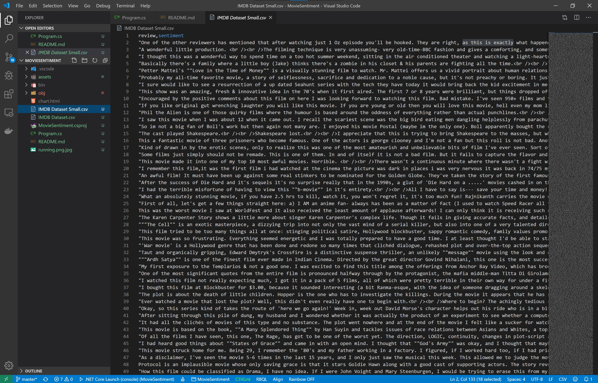

# Assignment: Detect the sentiment of IMDB movie reviews

In this assignment you're going to build an app that can automatically detect the sentiment of IMDB movie reviews.

The first thing you'll need is a dataset with thousands of movie reviews, correctly labelled as having positive of negative sentiment. The Kaggle IMDB dataset has exactly what we need. It's a collection of 50,000 highly polarized movie reviews with exactly 50% positive and 50% negative reviews. 

Your job is to build an app that reads the dataset and correctly predicts the sentiment for each review. 

You can download the [IMDB Movie Dataset](https://www.kaggle.com/lakshmi25npathi/imdb-dataset-of-50k-movie-reviews) here. Create a Kaggle account if you do not have one yet, then download the ZIP file and extract the **IMDB Dataset.csv** file.

The data file looks like this:



It’s a CSV file with only 2 columns of information:

* Review: the full text of the movie review.
* Sentiment: ‘positive' for a positive movie review and ‘negative’ for a negative movie review.

This dataset contains 25,000 positive movie reviews and 25,000 negative movie reviews. You will build a binary classification network that reads in all reviews and then makes a prediction for each review if it is positive or negative.

Let’s get started. You need to build a new application from scratch by opening a terminal and creating a new NET Core console project:

```bash
$ dotnet new console -o MovieSentiment
$ cd MovieSentiment
```

Also make sure to copy the dataset file **IMDB Dataset.csv** into this folder because the code you're going to type next will expect it here.  

Now install the following packages

```bash
$ dotnet add package Microsoft.ML
$ dotnet add package CNTK.GPU
$ dotnet add package XPlot.Plotly
$ dotnet add package Fsharp.Core
```

**Microsoft.ML** is the Microsoft machine learning package. We will use to load and process the data from the dataset. The **CNTK.GPU** library is Microsoft's Cognitive Toolkit that can train and run deep neural networks. And **Xplot.Plotly** is an awesome plotting library based on Plotly. The library is designed for F# so we also need to pull in the **Fsharp.Core** library. 

The **CNTK.GPU** package will train and run deep neural networks using your GPU. You'll need an NVidia GPU and Cuda graphics drivers for this to work. 

If you don't have an NVidia GPU or suitable drivers, the library will fall back and use the CPU instead. This will work but training neural networks will take significantly longer.

CNTK is a low-level tensor library for building, training, and running deep neural networks. The code to build deep neural network can get a bit verbose, so I've developed a little wrapper called **CNTKUtil** that will help you write code faster. 

Please [download the CNTKUtil files](https://github.com/mdfarragher/DLR/tree/master/CNTKUtil) in a new **CNTKUtil** folder at the same level as your project folder.

Then make sure you're in the console project folder and crearte a project reference like this:

```bash
$ dotnet add reference ..\CNTKUtil\CNTKUtil.csproj
```

Now you are ready to start writing code. Edit the Program.cs file with Visual Studio Code and add the following code:

```csharp
using System;
using System.IO;
using System.Linq;
using Microsoft.ML;
using Microsoft.ML.Data;
using CNTK;
using CNTKUtil;
using XPlot.Plotly;

namespace MovieSentiment
{
    /// <summary>
    /// The ReviewData class contains one single movie review which may be positive or negative.
    /// </summary>
    public class ReviewData
    {
        [LoadColumn(0)] public string Review { get; set; }
        [LoadColumn(1)] public string Label { get; set; }
    }

    // the rest of the code goes here...
}
```

The **ReviewData** class holds all the data for one single movie review. Note how each field is tagged with a **LoadColumn** attribute that will tell the CSV data loading code from which column to import the data.

Unfortunately we can't train a deep neural network on text data directly. We first need to convert the data to numbers, for example with sparse vector encoding.

We'll get to that conversion later. For now we'll add a class here that will contain the converted text:

```csharp
/// <summary>
/// The ProcessedData class contains one single movie review which has been processed.
/// </summary>
public class ProcessedData
{
    public string Label { get; set; }
    public VBuffer<float> Features { get; set; }

    public float[] GetFeatures() => Features.DenseValues().ToArray();

    public float GetLabel() => Label == "positive" ? 1.0f : 0.0f;
}

// the rest of the code goes here...
```

There's the **Label** again, but notice how the review has now been converted to a **VBuffer<float>** and stored in the **Features** field. 

The **VBuffer** type is a sparse vector. It's going to store the sparse vector-encoded review text so we can train a neural network on it. The nice thing about this NET type is that it only stores the ones. The zeroes are not stored and do not occupy any space in memory. 

The **GetFeatures** method calls **DenseValues** to return the complete sparse vector and returns it as a **float[]** that our neural network understands. 

And there's a **GetLabel** method that returns 1 if the movie review is positive (indicated by the Label field containing the word 'positive') and 0 if the review is negative.

The features represent the sparse vector-encoded text that we will use to train the neural network on, and the label is the output variable that we're trying to predict. So here we're training on encoded text to predict if that text is positive or negative.

Now it's time to start writing the main program method:

```csharp
/// <summary>
/// The main program class.
/// </summary>
public class Program
{
    // filenames for data set
    private static string dataPath = Path.Combine(Environment.CurrentDirectory, "IMDB Dataset.csv");

    /// <summary>
    /// The main program entry point.
    /// </summary>
    /// <param name="args">The command line parameters.</param>
    static void Main(string[] args)
    {
        // set up a machine learning context
        var context = new MLContext();

        // load the dataset in memory
        Console.WriteLine("Loading data...");
        var data = context.Data.LoadFromTextFile<ReviewData>(
            path: dataPath, 
            hasHeader: true, 
            separatorChar: ',',
            allowQuoting: true);

        // use 80% for training and 20% for testing
        var partitions = context.Data.TrainTestSplit(data, testFraction: 0.2);

        // the rest of the code goes here...
    }
}
```

When working with the ML.NET library we always need to set up a machine learning context represented by the **MLContext** class.

The code calls the **LoadFromTextFile** method to load the CSV data in memory. Note the **ReviewData** type argument that tells the method which class to use to load the data.

We then use **TrainTestSplit** to split the data in a training partition containing 80% of the data and a testing partition containing 20% of the data.

Now it's time to build a pipeline to convert the text to sparse vector-encoded data. We'll use the **ProduceWordBags** component in the ML.NET machine learning library:

```csharp
// set up a pipeline to featurize the text
Console.WriteLine("Featurizing text...");
var pipeline = context.Transforms.Text.ProduceWordBags(
        outputColumnName: "Features", 
        inputColumnName: nameof(ReviewData.Review),
        ngramLength: 1,
        maximumNgramsCount: 5000);

// create a model
var model = pipeline.Fit(partitions.TrainSet);

// create training and testing datasets 
var trainingData = model.Transform(partitions.TrainSet);
var testingData = model.Transform(partitions.TestSet);

// create training and testing enumerations
var training = context.Data.CreateEnumerable<ProcessedData>(trainingData, reuseRowObject: false).ToArray();
var testing = context.Data.CreateEnumerable<ProcessedData>(testingData, reuseRowObject: false).ToArray();

// the rest of the code goes here...
```

Machine learning pipelines in ML.NET are built by stacking transformation components. Here we're using a single component, **ProduceWordBags**, that converts the text messages in **ReviewData.Review** into sparse vector-encoded bag of words in a new column called 'Features'.

Note that I'm specifying an Ngram length of one which means that I want to look at individual words, not combinations of words. And I am specifying a maximum Ngram count of 5000 which means every movie review will be converted to a sparse vector of 5000 elements. 

We call the **Fit** method to initialize the pipeline, and then call **Transform** twice to transform the text in the training and testing partitions. 

Finally we call **CreateEnumerable** to convert the training and testing data to an enumeration of **ProcessedData** instances. So now we have the training data in **training** and the testing data in **testing**. Both are enumerations of **ProcessedData** instances.

But CNTK can't train on an enumeration of class instances. It requires a **float[][]** for features and **float[]** for labels.

So we need to set up four float arrays:

```csharp
// set up data arrays
var training_data = training.Select(v => v.GetFeatures()).ToArray();
var training_labels = training.Select(v => v.GetLabel()).ToArray();
var testing_data = testing.Select(v => v.GetFeatures()).ToArray();
var testing_labels = testing.Select(v => v.GetLabel()).ToArray();

// the rest of the code goes here...
```

These LINQ expressions set up four arrays containing the feature and label data for the training and testing partitions.  

Now we need to tell CNTK what shape the input data has that we'll train the neural network on, and what shape the output data of the neural network will have: 

```csharp
// build features and labels
var features = NetUtil.Var(new int[] { 5000 }, DataType.Float);
var labels = NetUtil.Var(new int[] { 1 }, DataType.Float);

// the rest of the code goes here...
```

Remember the pipeline higher up in the code? It converts every movie review into a sparse vector (a bag of words) with a length of 5000 elements. So the first **Var** method tells CNTK that our neural network will use a 1-dimensional tensor of 5000 float values as input. This shape matches the array returned by the **ProcessedData.GetFeatures** method. 

And the second **Var** method tells CNTK that we want our neural network to output a single float value. This shape matches the single value returned by the **ProcessedData.GetLabel** method.

Our next step is to design the neural network. We're going to build the following network:


This network uses two 1-dimensional convolutional layers, each followed by a pooling layer to reduce the width and height of the output tensor. Each convolutional layer uses a filter with a depth of 7 to process seven subsequent words in a movie review. 

So with this setup we are working with a dictionary of 5000 unique words (represented by the size of the input data) and a 1D-convolutional neural network that can process groups of 7 words to detect sentiment.  

We will use a single dense layer as the classifier with **Sigmoid** activation. 

Here's how to build this neural network:

```csharp
// build the network
var network = features
    .OneHotOp(10000, true)
    .Embedding(128)
    .TransposeAxes(new CNTK.Axis(1), new CNTK.Axis(0))
    .Convolution1D(32, 7, activation: CNTK.CNTKLib.ReLU)
    .Pooling(PoolingType.Max, new int[] { 5 }, new int[] { 5 })
    .Convolution1D(32, 7, activation: CNTK.CNTKLib.ReLU)
    .Pooling(PoolingType.Max, CNTK.NDShape.Unknown(), new int[] { 5 })
    .Dense(1, CNTKLib.Sigmoid)
    .ToNetwork();
Console.WriteLine("Model architecture:");
Console.WriteLine(network.ToSummary());

Console.WriteLine("Model architecture:");
Console.WriteLine(network.ToSummary());

// the rest of the code goes here...
```

Note how we're first calling **OneHotOp** to convert each word into a one-hot encoded vector with 10,000 elements. We then call **Embedding** to embed these values in a 128-dimensional space. The final call to **TransposeAxes** rotates  the tensor so that the words, which are originally stacked in the width direction, are now stacked in the depth direction. This allows the 1D convolution kernels to process groups of words. 

Each **Convolution1D** call adds a new 1-dimensional convolution layer to the network. Each convolution filter has 32 channels and uses a kernel depth of 7. 

We're stacking two layers, both using **ReLU** activation, and then add a final layer with a single node using **Sigmoid** activation.

Then we use the **ToSummary** method to output a description of the architecture of the neural network to the console.

Now we need to decide which loss function to use to train the neural network, and how we are going to track the prediction error of the network during each training epoch. 

For this assignment we'll use **BinaryCrossEntropy** as the loss function because it's the standard metric for measuring binary classification loss. 

We'll track the error with the **BinaryClassificationError** metric. This is the number of times (expressed as a percentage) that the model predictions are wrong. An error of 0 means the predictions are correct all the time, and an error of 1 means the predictions are wrong all the time. 

```csharp
// set up the loss function and the classification error function
var lossFunc = CNTKLib.BinaryCrossEntropy(network.Output, labels);
var errorFunc = NetUtil.BinaryClassificationError(network.Output, labels);

// the rest of the code goes here...
```

Next we need to decide which algorithm to use to train the neural network. There are many possible algorithms derived from Gradient Descent that we can use here.

For this assignment we're going to use the **AdamLearner**. You can learn more about the Adam algorithm here: [https://machinelearningmastery.com/adam...](https://machinelearningmastery.com/adam-optimization-algorithm-for-deep-learning/)

```csharp
// set up a learner
var learner = network.GetAdamLearner(
    learningRateSchedule: (0.001, 1),
    momentumSchedule: (0.9, 1),
    unitGain: true);

// the rest of the code goes here...
```

These configuration values are a good starting point for many machine learning scenarios, but you can tweak them if you like to try and improve the quality of your predictions.

We're almost ready to train. Our final step is to set up a trainer and an evaluator for calculating the loss and the error during each training epoch:

```csharp
// set up a trainer and an evaluator
var trainer = network.GetTrainer(learner, lossFunc, errorFunc);
var evaluator = network.GetEvaluator(errorFunc);

// train the model
Console.WriteLine("Epoch\tTrain\tTrain\tTest");
Console.WriteLine("\tLoss\tError\tError");
Console.WriteLine("-----------------------------");

// the rest of the code goes here...
```

The **GetTrainer** method sets up a trainer which will track the loss and the error for the training partition. And **GetEvaluator** will set up an evaluator that tracks the error in the test partition. 

Now we're finally ready to start training the neural network!

Add the following code:

```csharp
var maxEpochs = 10;
var batchSize = 16;
var loss = new double[maxEpochs];
var trainingError = new double[maxEpochs];
var testingError = new double[maxEpochs];
var batchCount = 0;
for (int epoch = 0; epoch < maxEpochs; epoch++)
{
    // training and testing code goes here...
}

// show final results
var finalError = testingError[maxEpochs-1];
Console.WriteLine();
Console.WriteLine($"Final test error: {finalError:0.00}");
Console.WriteLine($"Final test accuracy: {1 - finalError:0.00}");

// plotting code goes here...
```

We're training the network for 10 epochs using a batch size of 16. During training we'll track the loss and errors in the **loss**, **trainingError** and **testingError** arrays.

Once training is done, we show the final testing error on the console. This is the percentage of mistakes the network makes when predicting spam messages. 

Note that the error and the accuracy are related: accuracy = 1 - error. So we also report the final accuracy of the neural network. 

Here's the code to train the neural network. Put this inside the for loop:

```csharp
// train one epoch on batches
loss[epoch] = 0.0;
trainingError[epoch] = 0.0;
batchCount = 0;
training_data.Index().Shuffle().Batch(batchSize, (indices, begin, end) =>
{
    // get the current batch
    var featureBatch = features.GetBatch(training_data, indices, begin, end);
    var labelBatch = labels.GetBatch(training_labels, indices, begin, end);

    // train the network on the batch
    var result = trainer.TrainBatch(
        new[] {
            (features, featureBatch),
            (labels,  labelBatch)
        },
        false
    );
    loss[epoch] += result.Loss;
    trainingError[epoch] += result.Evaluation;
    batchCount++;
});

// show results
loss[epoch] /= batchCount;
trainingError[epoch] /= batchCount;
Console.Write($"{epoch}\t{loss[epoch]:F3}\t{trainingError[epoch]:F3}\t");

// testing code goes here...
```

The **Index().Shuffle().Batch()** sequence randomizes the data and splits it up in a collection of 16-record batches. The second argument to **Batch()** is a function that will be called for every batch.

Inside the batch function we call **GetBatch** twice to get a feature batch and a corresponding label batch. Then we call **TrainBatch** to train the neural network on these two batches of training data.

The **TrainBatch** method returns the loss and error, but only for training on the 64-record batch. So we simply add up all these values and divide them by the number of batches in the dataset. That gives us the average loss and error for the predictions on the training partition during the current epoch, and we report this to the console.

So now we know the training loss and error for one single training epoch. The next step is to test the network by making predictions about the data in the testing partition and calculate the testing error.

Put this code inside the epoch loop and right below the training code:

```csharp
// test one epoch on batches
testingError[epoch] = 0.0;
batchCount = 0;
testing_data.Batch(batchSize, (data, begin, end) =>
{
    // get the current batch for testing
    var featureBatch = features.GetBatch(testing_data, begin, end);
    var labelBatch = labels.GetBatch(testing_labels, begin, end);

    // test the network on the batch
    testingError[epoch] += evaluator.TestBatch(
        new[] {
            (features, featureBatch),
            (labels,  labelBatch)
        }
    );
    batchCount++;
});
testingError[epoch] /= batchCount;
Console.WriteLine($"{testingError[epoch]:F3}");
```

We don't need to shuffle the data for testing, so now we can call **Batch** directly. Again we're calling **GetBatch** to get feature and label batches, but note that we're now providing the **testing_data** and **testing_labels** arrays. 

We call **TestBatch** to test the neural network on the 16-record test batch. The method returns the error for the batch, and we again add up the errors for each batch and divide by the number of batches. 

That gives us the average error in the neural network predictions on the test partition for this epoch. 

After training completes, the training and testing errors for each epoch will be available in the **trainingError** and **testingError** arrays. Let's use XPlot to create a nice plot of the two error curves so we can check for overfitting:

```csharp
// plot the error graph
var chart = Chart.Plot(
    new [] 
    {
        new Graph.Scatter()
        {
            x = Enumerable.Range(0, maxEpochs).ToArray(),
            y = trainingError.Select(v => 1 - v),
            name = "training",
            mode = "lines+markers"
        },
        new Graph.Scatter()
        {
            x = Enumerable.Range(0, maxEpochs).ToArray(),
            y = testingError.Select(v => 1 - v),
            name = "testing",
            mode = "lines+markers"
        }
    }
);
chart.WithOptions(new Layout.Layout() 
{
    yaxis = new Graph.Yaxis()
    {
        rangemode = "tozero"
    }
});
chart.WithXTitle("Epoch");
chart.WithYTitle("Accuracy");
chart.WithTitle("Movie Review Sentiment");

// save chart
File.WriteAllText("chart.html", chart.GetHtml());
```

This code creates a **Plot** with two **Scatter** graphs. The first one plots **1 - trainingError** which is the training accuracy, and the second one plots **1 - testingError** which is the testing accuracy. 

Finally we use **File.WriteAllText** to write the plot to disk as a HTML file.

We're now ready to build the app, so this is a good moment to save your work ;) 

Go to the CNTKUtil folder and type the following:

```bash
$ dotnet build -o bin/Debug/netcoreapp3.0 -p:Platform=x64
```

This will build the CNKTUtil project. Note how we're specifying the x64 platform because the CNTK library requires a 64-bit build. 

Now go to the HeartDisease folder and type:

```bash
$ dotnet build -o bin/Debug/netcoreapp3.0 -p:Platform=x64
```

This will build your app. Note how we're again specifying the x64 platform.

Now run the app:

```bash
$ dotnet run
```

The app will create the neural network, load the dataset, train the network on the data, and create a plot of the training and testing errors for each epoch. 

The plot is written to disk in a new file called chart.html. Open the file now and take a look at the training and testing curves.

What is  your final testing accuracy? And what do the curves look like? Is the neural network overfitting?

Do you think this model is good at predicting text sentiment?

Try to improve the neural network by changing the network architecture. You can add more convolutional layers, increase the kernel depth, enlarge the bag of words, increase the batch size, or train for more epochs.

Did the changes help? What is the best accuracy you can achieve?

Post your results in our support group.
