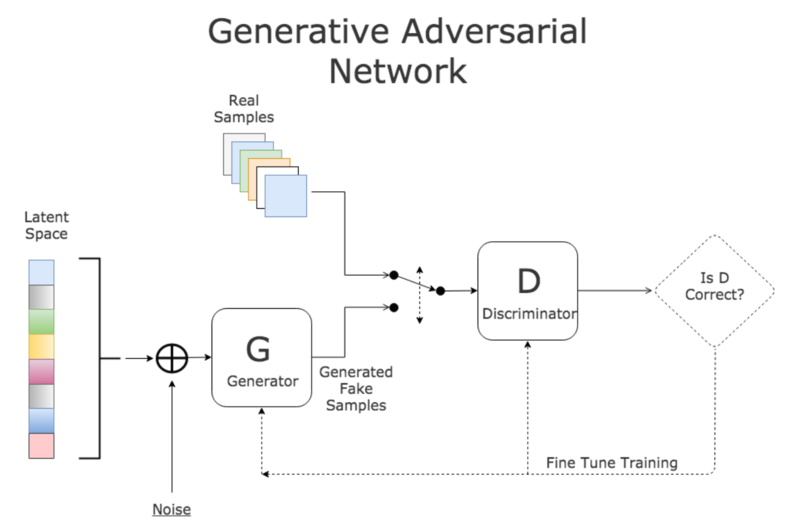
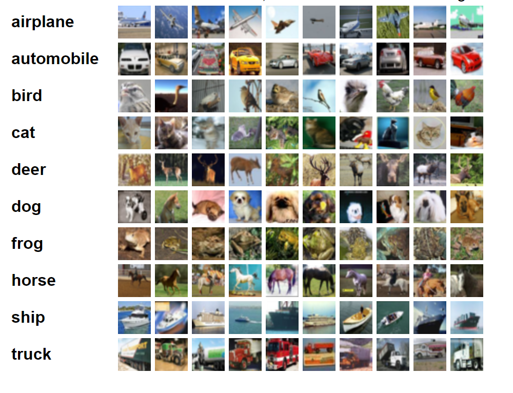
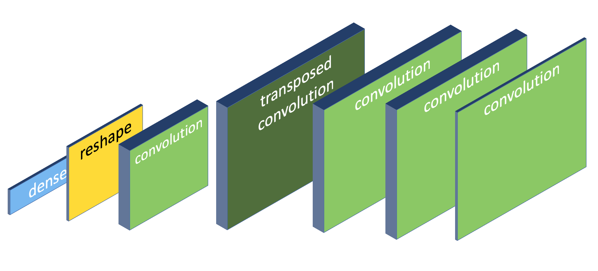
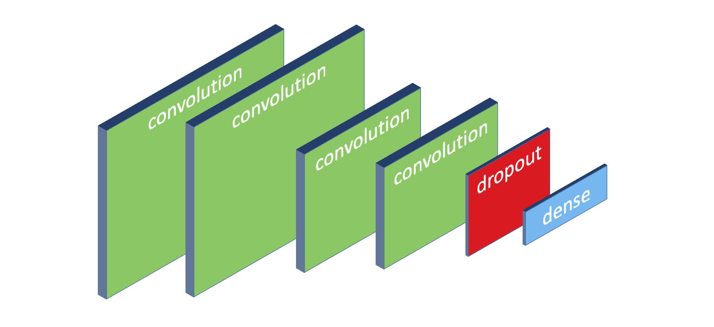

# Assignment: Create AI-generated wildlife

In this assignment you're going to use a specialized neural network architecture called a Generative Adversarial Network (GAN) to generate images of frogs. 



The generator part of the GAN uses a 1-dimensional latent input space to generate random images of frogs, and the discriminator will compare the real frog images with the generated ones and try to correctly classify all images. 

During each successive training epoch both the generator and discriminator will get smarter, and the generated images will get better and better. 

You're going to use the famous [CIFAR-10 dataset](https://en.wikipedia.org/wiki/CIFAR-10) which contains 60,000 color images of 32x32 pixels. Here's a sampling of the dataset for 10 random classes:



You'll use a subset of the dataset that contains 5,000 images of frog species. You can [download the image subset here](#). Save the file as **frog_pictures.zip** and place it in the project folder you're about to create below. 

Your challenge is to build an app that uses a GAN to generate better and better images of hypothetical frogs, until the images are so good that they look exactly like real frogs.

Let’s get started. You need to build a new application from scratch by opening a terminal and creating a new NET Core console project:

```bash
$ dotnet new console -o GanDemo
$ cd GanDemo
```

Also make sure to place the zip file with the frog images in this folder because the code you're going to type next will expect it here.  

Now install the following packages

```bash
$ dotnet add package CNTK.GPU
```

The **CNTK.GPU** library is Microsoft's Cognitive Toolkit that can train and run deep neural networks. It will train and run deep neural networks using your GPU. You'll need an NVidia GPU and Cuda graphics drivers for this to work. 

If you don't have an NVidia GPU or suitable drivers, the library will fall back and use the CPU instead. This will work but training neural networks will take significantly longer.

CNTK is a low-level tensor library for building, training, and running deep neural networks. The code to build deep neural network can get a bit verbose, so I've developed a little wrapper called **CNTKUtil** that will help you write code faster. 

Please [download the CNTKUtil files](https://github.com/mdfarragher/DLR/tree/master/CNTKUtil) in a new **CNTKUtil** folder at the same level as your project folder.

Then make sure you're in the console project folder and crearte a project reference like this:

```bash
$ dotnet add reference ..\CNTKUtil\CNTKUtil.csproj
```

Now you are ready to start writing code. Edit the Program.cs file with Visual Studio Code and add the following code:

```csharp
using System;
using System.IO;
using System.IO.Compression;
using System.Linq;
using CNTKUtil;

namespace GanDemo
{
    /// <summary>
    /// The application class.
    /// </summary>
    class Program
    {
        // the number of latent dimensions to use in the generator
        static readonly int latentDimensions = 32;

        // the image dimensions and number of color channels
        static readonly int imageHeight = 32;
        static readonly int imageWidth = 32;
        static readonly int channels = 3;

        /// <summary>
        /// The main program entry point.
        /// </summary>
        /// <param name="args"></param>
        static void Main(string[] args)
        {
            // unpack archive
            if (!File.Exists("x_channels_first_8_5.bin"))
            {
                Console.WriteLine("Unpacking archive...");
                ZipFile.ExtractToDirectory("frog_pictures.zip", ".");
            }

            // load training and test data
            Console.WriteLine("Loading data files...");
            var trainingData = DataUtil.LoadBinary<float>("x_channels_first_8_5.bin", 5000, channels * imageWidth * imageHeight);

            // the rest of the code goes here...
        }
    }
}
```

The code calls **ZipFile.ExtractToDirectory** to extract the dataset from the archive and store it in the project folder. 

Then we use the **DataUtil.LoadBinary** method to load the frog images in memory. You can see from the arguments that we're loading 5000 images of 32x32 pixels with 3 color channels.

Now we need to tell CNTK what shape the input data of the generator will have: 

```csharp
// create the generator input variable
var generatorVar = CNTK.Variable.InputVariable(new int[] { latentDimensions }, CNTK.DataType.Float, name: "generator_input");

// the rest of the code goes here...
```

The input to the generator is a 1-dimensional tensor with a preset number of latent dimensions (32 in this case). By inputting numbers on these 32 input nodes, we trigger the generator to create a new image that will hopefully resemble a frog.

Our next step is to design the generator. We're going to use an up-convolutional neural network with 7 layers that looks like this:



Here are some interesting facts about this network:

* The generator looks like a CNN in reverse. We start with a 1-dimensional input vector, the layers get progressively larger, and we end with a 32 by 32 pixel image at the output.
* There's a layer called Reshape. It converts the 1-dimensional output of the dense layer into a 2-dimensional tensor which more closely resembles an image.
* There's a layer called Transposed Convolution. This is a reverse version of the convolution layer that makes the image larger, not smaller.
* All the convolutional layers use the LeakyReLU activation function, not the regular ReLU function.
* The final convolutional layer at the end uses Hyperbolic Tan activation, and not the Sigmoid function.

You might be wondering how this specific architecture was discovered, and the answer is: by plain old trial and error. Many researchers have tried to create stable generators and they have come up with these guidelines.

Nobody really knows why this particular network architecture works well and all the alternatives are unstable. The field of machine learning is simply too young, and for now all we have are these field-tested rules of thumb.

Add the following code to build the generator:

```csharp
// create the generator
var generator = generatorVar
    .Dense(128 * 16 * 16, v => CNTK.CNTKLib.LeakyReLU(v, 0.1))
    .Reshape(new int[] { 16, 16, 128 })
    .Convolution2D(256, new int[] { 5, 5 }, padding: true, activation: v => CNTK.CNTKLib.LeakyReLU(v, 0.1))
    .ConvolutionTranspose(
        filterShape:     new int[] { 4, 4 },
        numberOfFilters: 256,
        strides:         new int[] { 2, 2 },
        outputShape:     new int[] { 32, 32 },
        padding:         true,
        activation:      v => CNTK.CNTKLib.LeakyReLU(v, 0.1)
    )
    .Convolution2D(256, new int[] { 5, 5 }, padding: true, activation: v => CNTK.CNTKLib.LeakyReLU(v, 0.1))
    .Convolution2D(256, new int[] { 5, 5 }, padding: true, activation: v => CNTK.CNTKLib.LeakyReLU(v, 0.1))
    .Convolution2D(channels, new int[] { 7, 7 }, padding: true, activation: CNTK.CNTKLib.Tanh)
    .ToNetwork();

// the rest of the code goes here...
```

This code calls **Dense** and **Reshape** to add a classifier and reshape the latent input to a tensor with a 16x16x128 shape. Then the code calls **Convolution2D** to add a convolution layer with a 5x5 kernel. 

The magic happens in the **ConvolutionTranspose** call that sets up a reverse convolution layer. The 16x16x256 input tensor is blown up to 32x32x256 using a 4x4 kernel and a stride of 2.

The output flows through two more **Convolution2D** layers and then encounters the final **Convolution2D** layer that converts the tensor to 32x32x3, exactly the dimensions of a generated CIFAR-10 color image.

Note the use of the **LeakyReLU** activation function everywhere, except in the final convolution layer that uses **Tanh**. 

Now we need to tell CNTK what shape the input data of the discriminator will have: 

```csharp
// create the discriminator input variable
var discriminatorVar = CNTK.Variable.InputVariable(new int[] { imageWidth, imageHeight, channels }, CNTK.DataType.Float, name: "discriminator_input");

// the rest of the code goes here...
```

Remember that the generator and the discriminator are mounted end-to-end, with the generated image feeding directly into the discriminator. So the input of the discriminator is our generated image, a tensor with a 32x32x3 shape. 

Now we're ready to build the discriminator. This is a regular convolutional neural network with 4 convolutional layers:



However, note that:

* There are no pooling layers in the network. Instead, the convolution layers use a 4 by 4 stride length to reduce the size of the feature maps.
* All the convolutional layers again use the LeakyReLU activation function for extra stability.

This was again discovered by trial and error.

Neural networks that use strides are a lot more stable and robust than networks that rely on pooling. And we need that extra stability to get the GAN working.

The following code will build the discriminator:

```csharp
// create the discriminator
var discriminator = discriminatorVar
    .Convolution2D(128, new int[] { 3, 3 }, activation: v => CNTK.CNTKLib.LeakyReLU(v, 0.1))
    .Convolution2D(128, new int[] { 4, 4 }, strides: new int[] { 2, 2 }, activation: v => CNTK.CNTKLib.LeakyReLU(v, 0.1))
    .Convolution2D(128, new int[] { 4, 4 }, strides: new int[] { 2, 2 }, activation: v => CNTK.CNTKLib.LeakyReLU(v, 0.1))
    .Convolution2D(128, new int[] { 4, 4 }, strides: new int[] { 2, 2 }, activation: v => CNTK.CNTKLib.LeakyReLU(v, 0.1))
    .Dropout(0.4)
    .Dense(1, CNTK.CNTKLib.Sigmoid)
    .ToNetwork();

// the rest of the code goes here...
```

Note the four calls to **Convolution2D** to set up the convolution layers with **LeakyReLU** activation, and the **Dropout** and **Dense** calls to add a dropout layer and a classifier using **Sigmoid** activation.  

Now we're ready to assemble the GAN. This is very easy:

```csharp
// create the Gan
var gan = Gan.CreateGan(generator, discriminator);

// the rest of the code goes here...
```

The **Gan** helper class has a nice **CreateGan** method that will assemble a GAN from a generator and a discriminator by joining them together.

Now we need to tell CNTK the shape of the output of the GAN:

```csharp
// create the label variable
var labelVar = CNTK.Variable.InputVariable(shape: new CNTK.NDShape(0), dataType: CNTK.DataType.Float, name: "label_var");

// the rest of the code goes here...
```

Remember that a GAN is a generator and a discriminator laid end to end. The discriminator classifies all images into fakes and non-fakes and only has a single output node. So the GAN itself also has a single output node, and we can tell CNTK that the output is a 0-dimensional tensor (= a single node).

Now we need to set up the loss function to use to train the discriminator and the GAN. Since we're basically classifying images into a single class (fake/non-fake), we can use binary cross entropy here:

```csharp
// set up the loss functions
var discriminatorLoss = CNTK.CNTKLib.BinaryCrossEntropy(discriminator, labelVar);
var ganLoss = CNTK.CNTKLib.BinaryCrossEntropy(gan, labelVar);

// the rest of the code goes here...
```

Next we need to decide which algorithm to use to train the discriminator and the GAN. There are many possible algorithms derived from Gradient Descent that we can use here.

For this assignment we're going to use the **AdaDeltaLearner**. This learning algorithm works well for training GANs:

```csharp
// set up the learners
var discriminatorLearner = discriminator.GetAdaDeltaLearner(1);
var ganLearner = gan.GetAdaDeltaLearner(1);

// the rest of the code goes here...
```

We're almost ready to train the GAN. Our final step is to set up trainers for calculating the discriminator and gan loss during each training epoch:

```csharp
// set up the trainers
var discriminatorTrainer = discriminator.GetTrainer(discriminatorLearner, discriminatorLoss, discriminatorLoss);
var ganTrainer = gan.GetTrainer(ganLearner, ganLoss, ganLoss);

// the rest of the code goes here...
```

The **GetTrainer** method sets up two trainers that will track the discriminator and gan loss during the training process. 

Now we're finally ready to start training!

Let's set up an output folder to store the images:

```csharp
// make sure we have an images folder to write to
var outputFolder = "images";
if (!Directory.Exists(outputFolder))
{
    Directory.CreateDirectory(outputFolder);
}

// the rest of the code goes here...
```

And now we can start training:

```csharp
// train the gan for multiple epochs
Console.WriteLine("Training Gan...");
var numEpochs = 100_000;
var batchSize = 8;
var start = 0;
for (var epoch = 0; epoch < numEpochs; epoch++)
{
    // the rest of the code goes here...
}
```

We're training the GAN for 100,000 epochs using a batch size of 8 images. 

Training a GAN is a 5-step process:

1. Run the discriminator to get a list of fake images
2. Combine real and fake images into a training batch
3. Train the discriminator on this batch
4. Combine real and fake images into a misleading batch where every image has been incorrectly labelled
5. Train the GAN on the misleading batch to help the generator create better fakes

Let's start with training the discriminator:

```csharp
// run the generator and create a set of fake frog images
var generatedImages = Gan.GenerateImages(generator, batchSize, latentDimensions);

// get a training batch: a mix of fake and real images labelled correctly
start = Math.Min(start, trainingData.Length - batchSize);
var batch = Gan.GetTrainingBatch(discriminatorVar, generatedImages, trainingData, batchSize, start);
start += batchSize;
if (start >= trainingData.Length)
{
    start = 0;
}

// train the discriminator
var discriminatorResult = discriminatorTrainer.TrainBatch(
    new[] {
        (discriminator.Arguments[0], batch.featureBatch),
        (labelVar, batch.labelBatch)
    }, true);

// the rest of the code goes here...
```

The **Gan.GenerateImages** method uses the generator to create a list of fake images. We then call **Gan.GetTrainingBatch** to get a new batch of 8 images to train on. This batch contains a mix of real and fake images with each image correctly labelled.

We then call **TrainBatch** on the discriminator trainer to train the discriminator on this training batch. This will help the discriminator get better and better at spotting fakes.

We're halfway done. Now it's time to create the misleading batch and train the GAN:

```csharp
// get a misleading batch: all fake images but labelled as real
var misleadingBatch = Gan.GetMisleadingBatch(gan, batchSize, latentDimensions);

// train the gan
var ganResult = ganTrainer.TrainBatch(
    new[] {
        (gan.Arguments[0], misleadingBatch.featureBatch),
        (labelVar, misleadingBatch.labelBatch)
    }, true);

// the rest of the code goes here...
```

The **Gan.GetMisleadingBatch** method sets up a misleading batch. This is a training batch of real and fake images with every image labelled incorrectly. 

We then call **TrainBatch** on the GAN trainer to train the entire GAN on the misleading batch. This will help the generator create better fakes to fool the discriminator. 

And that's the entire training process.

Now let's log our progress every 100 epochs:

```csharp
// report result every 100 epochs
if (epoch % 100 == 0)
{
    Console.WriteLine($"Epoch: {epoch}, Discriminator loss: {discriminatorResult.Loss}, Gan loss: {ganResult.Loss}");
}

// the rest of the code goes here...
```

And we're going to pull the generated image from the middle of the GAN every 1,000 epochs:

```csharp
// save files every 1000 epochs
if (epoch % 1000 == 0)
{
    // save a generated image
    var path = Path.Combine(outputFolder, $"generated_frog_{epoch}.png");
    Gan.SaveImage(generatedImages[0].ToArray(), imageWidth, imageHeight, path);

    // save an actual image for comparison
    // path = Path.Combine(outputFolder, $"actual_frog_{epoch}.png");
    // Gan.SaveImage(trainingData[Math.Max(start - batchSize, 0)], imageWidth, imageHeight, path);
}
```

This code pulls the first generated image from the **generatedImages** variable and calls **Gan.SaveImage** to save it to disk.  

Optionally you can uncomment the second block of code to also save one of the training images to disk. This will let you compare the generated images to the training images, to see how well the GAN is doing at faking frog pictures.

We're ready to build the app, so this is a good moment to save your work ;) 

Go to the CNTKUtil folder and type the following:

```bash
$ dotnet build -o bin/Debug/netcoreapp3.0 -p:Platform=x64
```

This will build the CNKTUtil project. Note how we're specifying the x64 platform because the CNTK library requires a 64-bit build. 

Now go to the project folder and type:

```bash
$ dotnet build -o bin/Debug/netcoreapp3.0 -p:Platform=x64
```

This will build your app. Note how we're again specifying the x64 platform.

Now run the app:

```bash
$ dotnet run
```

The app will create the GAN, load the CIFAR-10 images, train the GAN on the images, and extract a generated image every 1,000 epochs. 

What do your images look like? Do they look like real frogs? 

You'll notice that GANs are notoriously unstable. Your app will crash if you set the batch size larger than 12, and quite often the GAN gets stuck in a false minimum and generates the same image over and over again. 

You'll have to run your app many times to get a good result. 

Give it a shot and post your best results in our support group.
