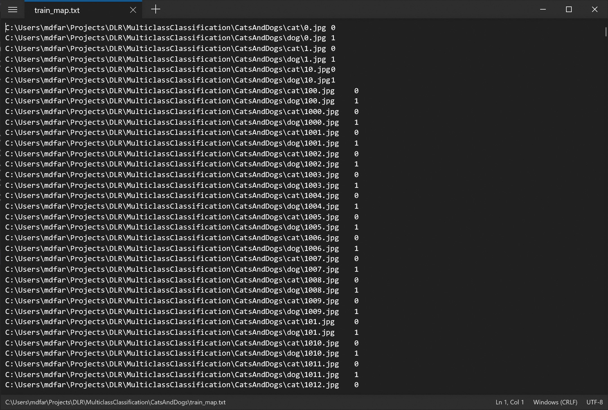
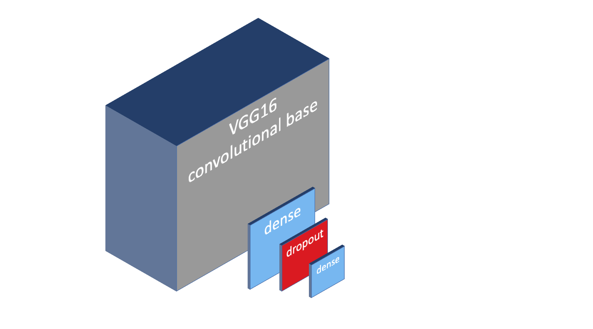
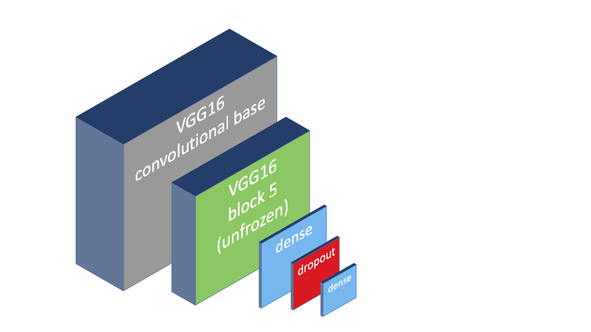

# Assignment: Recognize cats and dogs

In this assignment you are going to build an app which must be able to identify cats and dogs in any image. 

The easiest way to do this is to build a convolutional neural network and train it on a dataset of cat and dog images. The **Kaggle cats and dogs** dataset has exactly what we need.

You can [download the dataset here](#). Unzip the archive and make sure the **cat** and **dog** folders are created in the project folder you're going to create below.

Here's what the dataset looks like:


These are 2000 pictures of cats. We also have a second set with 2000 images of dogs. 

You will need to train a neural network on these image sets and get the cat and dog detection accuracy as high as possible.

Let’s get started. You need to build a new application from scratch by opening a terminal and creating a new NET Core console project:

```bash
$ dotnet new console -o CatsAndDogs
$ cd CatsAndDogs
```

Also make sure to copy the dataset folders **cat** and **dog** into this folder because the code you're going to type next will expect it here.  

Now install the following packages

```bash
$ dotnet add package CNTK.GPU
$ dotnet add package XPlot.Plotly
$ dotnet add package Fsharp.Core
```

The **CNTK.GPU** library is Microsoft's Cognitive Toolkit that can train and run deep neural networks. And **Xplot.Plotly** is an awesome plotting library based on Plotly. The library is designed for F# so we also need to pull in the **Fsharp.Core** library. 

The **CNTK.GPU** package will train and run deep neural networks using your GPU. You'll need an NVidia GPU and Cuda graphics drivers for this to work. 

If you don't have an NVidia GPU or suitable drivers, the library will fall back and use the CPU instead. This will work but training neural networks will take significantly longer.

CNTK is a low-level tensor library for building, training, and running deep neural networks. The code to build deep neural network can get a bit verbose, so I've developed a little wrapper called **CNTKUtil** that will help you write code faster. 

Please [download the CNTKUtil files](https://github.com/mdfarragher/DLR/tree/master/CNTKUtil) in a new **CNTKUtil** folder at the same level as your project folder.

Then make sure you're in the console project folder and crearte a project reference like this:

```bash
$ dotnet add reference ..\CNTKUtil\CNTKUtil.csproj
```

Now you are ready to start writing code. Edit the Program.cs file with Visual Studio Code and add the following code:

```csharp
using System;
using System.IO;
using System.Linq;
using CNTK;
using CNTKUtil;
using XPlot.Plotly;

namespace CatsAndDogs
{
    /// <summary>
    /// The main program class.
    /// </summary>
    class Program
    {
        // the rest of the code goes here...
    }
}
```

The first thing you'll need to do is add a method to build the mapping files. These are text files that map each image in the dataset to a corresponding label. We will encode a dog with a '1' and a cat with a '0' value. So the mapping file should look like this:



You can see that each image has been paired with a label indicating if the image contains a dog or a cat. 

You're now going to add a method that will automatically create the mapping files. 

Add the following code:

```csharp
// filenames for data set
private static string trainMapPath = Path.Combine(Environment.CurrentDirectory, "train_map.txt");
private static string testMapPath = Path.Combine(Environment.CurrentDirectory, "test_map.txt");

// total number of images in the training set
private const int trainingSetSize = 1600; // 80% of 2000 images
private const int testingSetSize = 400;   // 20% of 2000 images

/// <summary>
/// Create the mapping files for features and labels
/// </summary>
static void CreateMappingFiles()
{
    // get both classes of images
    var class0Images = Directory.GetFiles(Path.Combine(Environment.CurrentDirectory, "cat"));
    var class1Images = Directory.GetFiles(Path.Combine(Environment.CurrentDirectory, "dog"));

    // generate train and test mapping files
    var mappingFiles = new string[] { trainMapPath, testMapPath };
    var partitionSizes = new int[] { trainingSetSize, testingSetSize };
    var imageIndex = 0;
    for (int mapIndex = 0; mapIndex < mappingFiles.Length; mapIndex++)
    {
        var filePath = mappingFiles[mapIndex];
        using (var dstFile = new StreamWriter(filePath))
        {
            for (var i = 0; i < partitionSizes[mapIndex]; i++)
            {
                var class0Path = Path.Combine("cat", class0Images[imageIndex]);
                var class1Path = Path.Combine("dog", class1Images[imageIndex]);
                dstFile.WriteLine($"{class0Path}\t0");
                dstFile.WriteLine($"{class1Path}\t1");
                imageIndex++;
            }
        }
        Console.WriteLine($"  Created file: {filePath}");
    }
    Console.WriteLine();
}
```

This method uses **Directory.GetFiles** to collect all image files in the dataset and then uses nested loops to write the file names to **train_map.txt** and **test_map.txt** files. These files contain all  image file names for training and testing the neural network. 

You can experiment with the sizes of the training and testing partitions by changing the values of the **trainingSetSize** and **testingSetSize** constants. Just make sure they both add up to 2000. 

Now it's time to start writing the main program method:

```csharp
// image details
private const int imageWidth = 150;
private const int imageHeight = 150;
private const int numChannels = 3;

/// <summary>
/// The main program entry point.
/// </summary>
/// <param name="args">The command line arguments.</param>
static void Main(string[] args)
{
    // create the mapping files
    Console.WriteLine("Creating mapping files...");
    CreateMappingFiles();

    // download the VGG16 network
    Console.WriteLine("Downloading VGG16...");
    if (!DataUtil.VGG16.IsDownloaded)
    {
        DataUtil.VGG16.Download();
    }

    // get a training and testing image readers
    var trainingReader = DataUtil.GetImageReader(trainMapPath, imageWidth, imageHeight, numChannels, 2, randomizeData: true, augmentData: true);
    var testingReader = DataUtil.GetImageReader(testMapPath, imageWidth, imageHeight, numChannels, 2, randomizeData: false, augmentData: false);

    // the rest of the code goes here...
}
```

This code calls **CreateMappingFiles** to set up the training and testing mapping files. Then it calls **VGG16.Download** to download the VGG16 neural network model file and save it in the project folder.

The VGG16 model file contains the value for every trainable parameter in the neural network. It's a 540 MB file that will be saved in a new **models** folder in the project directory. 

Finally the code calls **GetImageReader** twice to set up two image readers, one for the training images and one for the testing images. 

Note that the images in the training set are randomized. We do this to prevent the neural network from learning patterns associated with the specific sorting of the images in the dataset.

Also note that we're using data augmentation in the training set to artificially inflate the size of the set and give the neural network more data to train on. 

The **imageWidth**, **imageHeight**, and **numChannels** constants specify that we are going to rescale every image to 150x150 pixels and feed all 3 color channels into the neural network. This means we will be training directly on color images without transforming them to grayscale first. 

Now we need to tell CNTK what shape the input data has that we'll train the neural network on, and what shape the output data of the neural network will have: 

```csharp
// build features and labels
var features = NetUtil.Var(new int[] { imageHeight, imageWidth, numChannels }, DataType.Float);
var labels = NetUtil.Var(new int[] { 2 }, DataType.Float);

// the rest of the code goes here...
```

Note the first **Var** method which tells CNTK that our neural network will use a 3-dimensional tensor of 150 by 150 pixels with 3 color channels each. This matches the shape of the images returned by the **trainingReader** and **testingReader**. 

The second **Var** method tells CNTK that we want our neural network to output a 1-dimensional tensor of 2 float values. The first float will indicate the probability that the image contains a cat, and the second float indicates the probability that the image contains a dog.

Our next step is to design the neural network. 

We will use feature extraction on the VGG16 network. We'll load the full network in memory, and then remove the classifier and replace it with our own.

The final network looks like this:



The network has the following layers:

* A convolutional base consisting of blocks 1-5 of the VGG16 neural network. The weights in these layers are frozen and will not change during training
* A 256-node dense layer with ReLU
* A dropout layer with a 50% dropout rate
* A 2-node dense layer with Softmax

Even with all 5 blocks frozen, this is still a monster of a network. There are 3.2 million weights feeding into the first dense layer and all of these weights can be trained. So this network still has 3.2 million parameters!

Here's the code to build the neural network:

```csharp
// build the network
var network = features
    .MultiplyBy<float>(1.0f / 255.0f)  // divide all pixels by 255
    .VGG16(allowBlock5Finetuning: false)
    .Dense(256, CNTKLib.ReLU)
    .Dropout(0.5)
    .Dense(2, CNTKLib.Softmax)
    .ToNetwork();
Console.WriteLine("Model architecture:");
Console.WriteLine(network.ToSummary());

// the rest of the code goes here...
```

The **VGG16** call loads the VGG16 network in memory and removes the classifier. Note the **allowBlock5Finetuning** argument which we've set to false, indicating that we're not going to use finetuning right now.

The remaining calls set up a dense classifier with softmax and a dropout layer to stabilize the training. 

Then we use the **ToSummary** method to output a description of the architecture of the neural network to the console.

Now we need to decide which loss function to use to train the neural network, and how we are going to track the prediction error of the network during each training epoch. 

For this assignment we'll use **CrossEntropyWithSoftmax** as the loss function because it's the standard metric for measuring multiclass classification loss with softmax. 

We'll track the error with the **ClassificationError** metric. This is the number of times (expressed as a percentage) that the model predictions are wrong. An error of 0 means the predictions are correct all the time, and an error of 1 means the predictions are wrong all the time. 

```csharp
// set up the loss function and the classification error function
var lossFunction = CNTKLib.CrossEntropyWithSoftmax(network.Output, labels);
var errorFunction = CNTKLib.ClassificationError(network.Output, labels);

// the rest of the code goes here...
```

Next we need to decide which algorithm to use to train the neural network. There are many possible algorithms derived from Gradient Descent that we can use here.

For this assignment we're going to use the **AdamLearner**. You can learn more about the Adam algorithm here: [https://machinelearningmastery.com/adam...](https://machinelearningmastery.com/adam-optimization-algorithm-for-deep-learning/)

```csharp
// set up a learner
var learner = network.GetAdamLearner(
    learningRateSchedule: (0.001, 1),
    momentumSchedule: (0.9, 1),
    unitGain: true);

// the rest of the code goes here...
```

These configuration values are a good starting point for many machine learning scenarios, but you can tweak them if you like to try and improve the quality of your predictions.

We're almost ready to train. Our final step is to set up a trainer and an evaluator for calculating the loss and the error during each training epoch:

```csharp
// set up a trainer and an evaluator
var trainer = network.GetTrainer(learner, lossFunction, errorFunction);
var evaluator = network.GetEvaluator(errorFunction);

// train the model
Console.WriteLine("Epoch\tTrain\tTrain\tTest");
Console.WriteLine("\tLoss\tError\tError");
Console.WriteLine("-----------------------------");

// the rest of the code goes here...
```

The **GetTrainer** method sets up a trainer which will track the loss and the error for the training partition. And **GetEvaluator** will set up an evaluator that tracks the error in the test partition. 

Now we're finally ready to start training the neural network!

Add the following code:

```csharp
var maxEpochs = 50;
var batchSize = 16;
var loss = new double[maxEpochs];
var trainingError = new double[maxEpochs];
var testingError = new double[maxEpochs];
var batchCount = 0;
for (int epoch = 0; epoch < maxEpochs; epoch++)
{
    // training and testing code goes here...
}

// show final results
var finalError = testingError[maxEpochs-1];
Console.WriteLine();
Console.WriteLine($"Final test error: {finalError:0.00}");
Console.WriteLine($"Final test accuracy: {1 - finalError:0.00}");

// plotting code goes here...
```

We're training the network for 50 epochs using a batch size of 16. During training we'll track the loss and errors in the **loss**, **trainingError** and **testingError** arrays.

Once training is done, we show the final testing error on the console. This is the percentage of mistakes the network makes when predicting hotdogs. 

Note that the error and the accuracy are related: accuracy = 1 - error. So we also report the final accuracy of the neural network. 

Here's the code to train the neural network. Put this inside the for loop:

```csharp
// train one epoch on batches
loss[epoch] = 0.0;
trainingError[epoch] = 0.0;
var sampleCount = 0;
while (sampleCount < 2 * trainingSetSize)
{
    // get the current batch for training
    var batch = trainingReader.GetBatch(batchSize);
    var featuresBatch = batch[trainingReader.StreamInfo("features")];
    var labelsBatch = batch[trainingReader.StreamInfo("labels")];

    // train the model on the batch
    var result = trainer.TrainBatch(
        new[] {
            (features, featuresBatch),
            (labels,  labelsBatch)
        }
    );
    loss[epoch] += result.Loss;
    trainingError[epoch] += result.Evaluation;
    sampleCount += (int)featuresBatch.numberOfSamples;
    batchCount++;                
}

// show results
loss[epoch] /= batchCount;
trainingError[epoch] /= batchCount;
Console.Write($"{epoch}\t{loss[epoch]:F3}\t{trainingError[epoch]:F3}\t");

// testing code goes here...
```

The **while** loop keeps training unit we've processed every image in the training set once. Inside the loop we call **GetBatch** to get a training batch of images and then access the **StreamInfo** method to get the feature batch (the images) and the label batch (the zeroes and ones indicating cats and dogs). Then we call **TrainBatch** to train the neural network on these two batches of training data.

The **TrainBatch** method returns the loss and error, but only for training on the 16-image batch. So we simply add up all these values and divide them by the number of batches in the dataset. That gives us the average loss and error for the predictions on the training partition during the current epoch, and we report this to the console.

So now we know the training loss and error for one single training epoch. The next step is to test the network by making predictions about the data in the testing partition and calculate the testing error.

Put this code inside the epoch loop and right below the training code:

```csharp
// test one epoch on batches
testingError[epoch] = 0.0;
batchCount = 0;
sampleCount = 0;
while (sampleCount < 2 * testingSetSize)
{
    // get the current batch for testing
    var batch = testingReader.GetBatch(batchSize);
    var featuresBatch = batch[testingReader.StreamInfo("features")];
    var labelsBatch = batch[testingReader.StreamInfo("labels")];

    // test the model on the batch
    testingError[epoch] += evaluator.TestBatch(
        new[] {
            (features, featuresBatch),
            (labels,  labelsBatch)
        }
    );
    sampleCount += (int)featuresBatch.numberOfSamples;
    batchCount++;
}

// show results
testingError[epoch] /= batchCount;
Console.WriteLine($"{testingError[epoch]:F3}");
```

Again we use a **while** loop to process each image in the partition, calling **GetBatch** to get the images and **StreamInfo** to access the feature and label batches. But note that we're now providing the **testingReader** to get the images in the test set. 

We call **TestBatch** to test the neural network on the 16-image test batch. The method returns the error for the batch, and we again add up the errors for each batch and divide by the number of batches. 

That gives us the average error in the neural network predictions on the test partition for this epoch. 

After training completes, the training and testing errors for each epoch will be available in the **trainingError** and **testingError** arrays. Let's use XPlot to create a nice plot of the two error curves so we can check for overfitting:

```csharp
// plot the error graph
var chart = Chart.Plot(
    new [] 
    {
        new Graph.Scatter()
        {
            x = Enumerable.Range(0, maxEpochs).ToArray(),
            y = trainingError.Select(v => 1 - v),
            name = "training",
            mode = "lines+markers"
        },
        new Graph.Scatter()
        {
            x = Enumerable.Range(0, maxEpochs).ToArray(),
            y = testingError.Select(v => 1 - v),
            name = "testing",
            mode = "lines+markers"
        }
    }
);
chart.WithXTitle("Epoch");
chart.WithYTitle("Accuracy");
chart.WithTitle("Hotdogs and Not-Hotdogs Training");

// save chart
File.WriteAllText("chart.html", chart.GetHtml());
```

This code creates a **Plot** with two **Scatter** graphs. The first one plots the **trainingError** values and the second one plots the **testingError** values. 

Finally we use **File.WriteAllText** to write the plot to disk as a HTML file.

We're now ready to build the app, so this is a good moment to save your work ;) 

Go to the CNTKUtil folder and type the following:

```bash
$ dotnet build -o bin/Debug/netcoreapp3.0 -p:Platform=x64
```

This will build the CNKTUtil project. Note how we're specifying the x64 platform because the CNTK library requires a 64-bit build. 

Now go to the CatsAndDogs folder and type:

```bash
$ dotnet build -o bin/Debug/netcoreapp3.0 -p:Platform=x64
```

This will build your app. Note how we're again specifying the x64 platform.

Now run the app:

```bash
$ dotnet run
```

The app will create the neural network, load the dataset, train the network on the images, and create a plot of the training and testing errors for each epoch. 

The plot is written to disk in a new file called chart.html. Open the file now and take a look at the training and testing curves.

What are your final classification errors on training and testing? What is the final testing accuracy? And what do the curves look like? Is the neural network overfitting?

Do you think this model is good at predicting cats and dogs?

Now let's improve the accuracy of the model. You are going to enable **finetuning** and train the final convolutional block in the VGG16 network too. 

The neural network now looks like this:



You can see that it's similar to the previous network but now the weights in block5 of the VGG16 model have been unfrozen. They can change during training, which means that the network can learn new visual features from the cats and dogs in the dataset.

The network has the following layers:

* A convolutional base consisting of blocks 1-4 of the VGG16 neural network. The weights in these layers are frozen and will not change during training.
* Block 5 in the VGG16 neural network with all weights unfrozen. The convolutional layers in this block can be trained to pick up new visual features.
* A 256-node dense layer with ReLU
* A dropout layer with a 50% dropout rate
* A 2-node dense layer with Softmax

The network now has 10.3 million trainable weights! 

Setting up finetuning is very easy. Change the code that sets up the network as follows:

```csharp
// build the network
var network = features
    .MultiplyBy<float>(1.0f / 255.0f)  // divide all pixels by 255
    .VGG16(allowBlock5Finetuning: true)
    .Dense(256, CNTKLib.ReLU)
    .Dropout(0.5)
    .Dense(2, CNTKLib.Softmax)
    .ToNetwork();
```

The change is that the **allowBlock5Finetuning** argument in the **VGG16** call is now set to true. The CNTKUtil code will now load the VGG16 code but unfreeze convolution block 5 and allow it to be trained too. 

Training this network for too long will completely destabilize it and destroy all trained information. This is a frequent problem when finetuning. So what we're going to do is also halve the number of training epochs:

```csharp
// train the model
...
var maxEpochs = 25;
...
```

Now compile and run the app again:

```bash
$ dotnet build -o bin/Debug/netcoreapp3.0 -p:Platform=x64; dotnet run
```

What is your final accuracy on testing now? Has the model improved?

And what changes do you see in the shape of the training and testing curves? Can you explain how finetuning has produced these changes? 

Share your results and conclusions in our group.