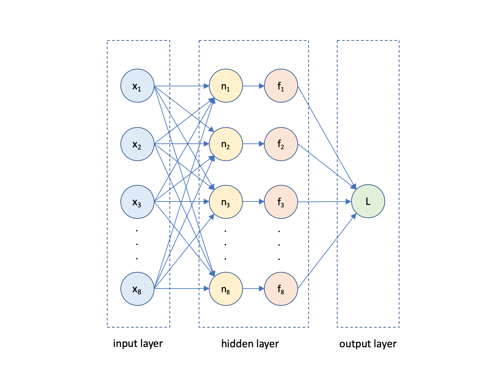

# Assignment: Predict house prices in California

In this assignment you're going to build an app that trains a deep neural network on a dataset of house prices in the state of California. 

So the first thing you'll need is the data file with house prices. The 1990 California cencus has exactly what we need. 

Download the [California 1990 housing census](https://github.com/mdfarragher/DSC/blob/master/LoadingData/CaliforniaHousing/california_housing.csv) and save it as **california_housing.csv**. 

This is a CSV file with 17,000 records that looks like this:




The file contains information on 17k housing blocks all over the state of California:

* Column 1: The longitude of the housing block
* Column 2: The latitude of the housing block
* Column 3: The median age of all the houses in the block
* Column 4: The total number of rooms in all houses in the block
* Column 5: The total number of bedrooms in all houses in the block
* Column 6: The total number of people living in all houses in the block
* Column 7: The total number of households in all houses in the block
* Column 8: The median income of all people living in all houses in the block
* Column 9: The median house value for all houses in the block

We can use this data to train a deep neural network to predict the value of any house in and outside the state of California. 

Let's get started. 

In these assignments you will not be using the code in Github. Instead, you'll be building all the applications 100% from scratch. So please make sure to create a new folder somewhere to hold all of your assignments.

Now please open a console or Powershell window. You are going to create a new subfolder for this assignment and set up a blank console application:

```bash
$ dotnet new console -o HousePricePrediction
$ cd HousePricePrediction
```

Also make sure to copy the dataset file(s) into this folder because the code you're going to type next will expect them here.  

Now install the following packages

```bash
$ dotnet add package Microsoft.ML
$ dotnet add package CNTK.GPU
$ dotnet add package XPlot.Plotly
$ dotnet add package Fsharp.Core
```

**Microsoft.ML** is the Microsoft machine learning package. We will use to load and process the data from the dataset. The **CNTK.GPU** library is Microsoft's Cognitive Toolkit that can train and run deep neural networks. And **Xplot.Plotly** is an awesome plotting library based on Plotly. The library is designed for F# so we also need to pull in the **Fsharp.Core** library. 

The **CNTK.GPU** package will train and run deep neural networks using your GPU. You'll need an NVidia GPU and Cuda graphics drivers for this to work. 

If you don't have an NVidia GPU or suitable drivers, you can also opt to train and run the neural networks on your CPU. In that case please install the **CNTK.CPUOnly** package instead.

CNTK is a low-level tensor library for building, training, and running deep neural networks. The code to build deep neural network can get a bit verbose, so I've developed a wrapper called **CNTKUtil** that will help you write code faster. 

Please [download the CNTKUtil files](#) in a new **CNTKUtil** folder at the same level as your project folder.

Then make sure you're in the console project folder and crearte a project reference like this:

```bash
$ dotnet add reference ..\CNTKUtil\CNTKUtil.csproj
```

Now you are ready to add classes. You’ll need a new class to hold all the information for a single housing block.

Edit the Program.cs file with Visual Studio Code and add the following code:

```csharp
using System;
using System.IO;
using System.Linq;
using CNTK;
using CNTKUtil;
using XPlot.Plotly;
using Microsoft.ML;
using Microsoft.ML.Data;

namespace HousePricePrediction
{
   /// <summary>
    /// The HouseBlockData class holds one single housing block data record.
    /// </summary>
    public class HouseBlockData
    {
        [LoadColumn(0)] public float Longitude { get; set; }
        [LoadColumn(1)] public float Latitude { get; set; }
        [LoadColumn(2)] public float HousingMedianAge { get; set; }
        [LoadColumn(3)] public float TotalRooms { get; set; }
        [LoadColumn(4)] public float TotalBedrooms { get; set; }
        [LoadColumn(5)] public float Population { get; set; }
        [LoadColumn(6)] public float Households { get; set; }
        [LoadColumn(7)] public float MedianIncome { get; set; }
        [LoadColumn(8)] public float MedianHouseValue { get; set; }

        public float[] GetFeatures() => new float[] { Longitude, Latitude, HousingMedianAge, TotalRooms, TotalBedrooms, Population, Households, MedianIncome }; 

        public float GetLabel() => MedianHouseValue / 1000.0f;
    }

    // the rest of the code goes here...
}
```

The **HouseBlockData** class holds all the data for one single housing block. Note how each field is tagged with a **LoadColumn** attribute that will tell the CSV data loading code which column to import data from.

We also have a **GetFeatures** method that returns the longitude, latitude, median age, total number of rooms, total number of bedrooms, total population, number of households, and median income level of a housing block.

And there's a **GetLabel** method that return the median house value in thousands of dollars.

The features are the house attributes that we will use to train the neural network on, and the label is the output variable that we're trying to predict. So here we're training on every column in the dataset to predict the median house value. 

Now we need to set up a custom **TrainingEngine** which is a helper class from the CNTKUtil library that will help us train and run a deep neural network:

```csharp
/// <summary>
/// HouseTrainingEngine is a custom training engine for this assignment.
/// </summary>
class HouseTrainingEngine : TrainingEngine
{
    /// <summary>
    /// Set up the feature variable.
    /// </summary>
    /// <returns>The feature variable to use.</returns>
    protected override Variable CreateFeatureVariable()
    {
        return NetUtil.Var(new int[] { 8 }, DataType.Float);
    }

    /// <summary>
    /// Set up the label variable.
    /// </summary>
    /// <returns>The label variable to use.</returns>
    protected override Variable CreateLabelVariable()
    {
        return NetUtil.Var(new int[] { 1 }, DataType.Float);
    }

    // the rest of the code goes here...
}
```

Note the **CreateFeatureVariable** override which tells CNTK that our neural network will use a 1-dimensional tensor of 8 float values as input. This shape matches the 8 values returned by the **HouseBlockData.GetFeatures** method. 

And the **CreateLabelVariable** override tells CNTK that we want our neural network to output a single float value. This shape matches the single value returned by the **HouseBlockData.GetLabel** method.

We're almost done with the training engine. Our final step is to design the neural network. 

We will use the following neural network to predict house prices:



This is a deep neural network with an 8-node input layer, an 8-node hidden layer, and a single-node output layer. We'll use the **ReLU** activation function everywhere. 

Here's how to build this neural network:

```csharp
/// <summary>
/// Set up the model.
/// </summary>
/// <param name="features">The input feature to use.</param>
/// <returns>The completed model.</returns>
protected override Function CreateModel(Variable features)
{
    return features
        .Dense(8, CNTKLib.ReLU)
        .Dense(8, CNTKLib.ReLU)
        .Dense(1)
        .ToNetwork();
}
```
The **CreateModel** override builds the neural network. Note how each call to **Dense** adds another dense layer with the ReLU activation function to the network

With the training engine fully set up, we can now load the dataset in memory. We're going to use an ML.NET data pipeline for the heavy lifting:

```csharp
class Program
{
    /// <summary>
    /// The main entry point of the application.
    /// </summary>
    /// <param name="args">The command line arguments.</param>
    [STAThread]
    public static void Main(string[] args)
    {
        // create the machine learning context
        var context = new MLContext();

        // load the dataset
        Console.WriteLine("Loading data...");
        var data = context.Data.LoadFromTextFile<HouseBlockData>(
            path: "california_housing.csv", 
            hasHeader:true, 
            separatorChar: ',');

        // split into training and testing partitions
        var partitions = context.Data.TrainTestSplit(data, 0.2);

        // load training and testing data
        var training = context.Data.CreateEnumerable<HouseBlockData>(partitions.TrainSet, reuseRowObject: false);
        var testing = context.Data.CreateEnumerable<HouseBlockData>(partitions.TestSet, reuseRowObject: false);

        // the rest of the code goes here...
    }
}
```

This code calls the **LoadFromTextFile** method to load the CSV data in memory. Note the **HouseBlockData** type argument that tells the method which class to use to load the data.

We then use **TrainTestSplit** to split the data in a training partition containing 80% of the data and a testing partition containing 20% of the data.

Finally we call **CreateEnumerable** to convert the two partitions to an enumeration of **HouseBlockData** instances.

Now we're ready to set up the training engine. Add the following code:

```csharp
// set up a new training engine
Console.WriteLine("Setting up training engine...");
var engine = new HouseTrainingEngine()
{
    LossFunction = TrainingEngine.LossFunctionType.MSE,
    MetricType = TrainingEngine.MetricTypeEnum.Loss,
    NumberOfEpochs = 50,
    BatchSize = 16,
    LearningRate = 0.001
};

// the rest of the code goes here
```

We're instantiating a new training engine and configure it to use the MSE metric (= Mean Square Error) to measure the training and testing loss. We're going to train for 50 epochs with a batch size of 16 and a learning rate of 0001. 

Now let's load the data from the ML.NET pipeline into the neural network:

```csharp
// load the data into the engine
engine.SetData(
    training.Select(v => v.GetFeatures()).ToArray(), 
    training.Select(v => v.GetLabel()).ToArray(), 
    testing.Select(v => v.GetFeatures()).ToArray(), 
    testing.Select(v => v.GetLabel()).ToArray());

// the rest of the code goes here...
```

The **SetData** method loads data into the neural network and expects training features, training labels, testing features, and testing labels, in that order. Note how we're using the **GetFeatures** and **GetLabel** methods we set up earlier. 

And that's it. The following code will start the training engine and train the neural network:

```csharp
// start the training
Console.WriteLine("Start training...");
engine.Train();

// the rest of the code goes here...
```

After training completes, the complete training and testing curves will be stored in the training engine. 

Let's use XPlot to create a nice plot of the two curves so we can check for overfitting:

```csharp
// plot training and testing curves
var chart = Chart.Plot(
    new [] 
    {
        new Graph.Scatter()
        {
            x = engine.TrainingCurve.Select(value => value.X).ToArray(),
            y = engine.TrainingCurve.Select(value => Math.Sqrt(value.Y)).ToArray(),
            name = "training",
            mode = "lines+markers"
        },
        new Graph.Scatter()
        {
            x = engine.TestingCurve.Select(value => value.X).ToArray(),
            y = engine.TestingCurve.Select(value => Math.Sqrt(value.Y)).ToArray(),
            name = "testing",
            mode = "lines+markers"
        }
    }
);
chart.WithXTitle("Epoch");
chart.WithYTitle("Loss (RMSE)");
chart.WithTitle("California Housing Training");

// save chart
File.WriteAllText("chart.html", chart.GetHtml());
```

This code creates a **Plot** with two **Scatter** graphs. The first one plots the **TrainingCurve** and the second one plots the **TestingCurve**. 

Both curves are defined as the loss values per training epoch. And note the **Sqrt** method to convert the MSE loss to RMSE ( = Root Mean Square Error).

Finally we use **File.WriteAllText** to write the plot to disk as a HTML file.

We're now ready to run the app, so this is a good moment to save your work ;) 

Type the following:

```bash
$ dotnet build -o bin/Debug/netcoreapp3.0 -p:Platform=x64
```

This will build the app. Note how we're specifying the x64 platform, because the CNTK library requires a 64-bit build. 

Now run the app:

```bash
$ dotnet run
```

The app will write the plot to a new file called chart.html. Open the file and check out the training and testing curves.

What are your final RMSE values on training and testing? And what do the curves look like? Is the neural network overfitting?

Try to improve the neural network by adding more nodes, extra layers, or changing the number of epochs, the batch size, or the learning rate.

Did the changes help? What is the best RMSE you can achieve?

Post your results in our support team.
